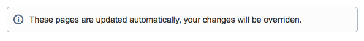

__Table of contents__

[TOC]

## Configuring the connection
The connection requires three parameters `base_url`, `user` and `pass`. While `user` and `pass` don't really need an explanation, for `base_url` you need to set the path to the server without `rest/api`, this will be added automatically.

```json
{
  "confluence": {
    "base_url": "http://my_confluence_server.com/",
    "user" : "my_username",
    "pass" : "my_password" 
  }
}
```

## Where to upload
Now that the connection is defined, you need to tell it where you want your documentation to be uploaded.

For that you need a `space_id` (name that appears at the beginning of the urls) and an `ancestor_id`; the id of the page that will be the parent of the documentation's homepage.

You can obtain the `ancestor_id` id by editing the page you want to define as a parent: the ID is at the end of the URL

```json
{
  "confluence": {
    "space_id": "my_space",
    "ancestor_id": 50370632
  }
}
```

You can also provide a `root_id` instead of an `ancestor_id` in this case, you specify the id as the homepage of your documentation.

You can use that when you're uploading your documentation to the root of a Confluence Space or if your page already exists.

## Prefix
Because confluence can't have two pages with the same name in a space, I recommend you define a prefix for your pages.

```json
{
  "confluence": { "prefix": "DAUX -" }
}
```

## Update threshold
To make the upload quicker, we try to determine if a page changed or not, first with a strict comparison and if it's not completely identical, we compute the difference.

```json
{
  "confluence": { "update_threshold": 1 }
}
```

If you set `update_threshold` to 1, it will upload only if the page has more than 1% difference with the previous one.

By default the threshold is 2%.

Setting the value to `0` disables the feature altogether.


## Delete old pages
When a page is renamed, there is no way to tell it was renamed, so when uploading to Confluence, the page will be uploaded and the old page will stay here.

By default, it will inform you that some pages aren't needed anymore and you can delete them by hand.

```json
{
  "confluence": { "delete": true }
}
```

By setting `delete` to `true` (or running `daux.phar` with the `--delete` flag) you tell the generator that it can safely delete the pages.


## Information message
When you create your page. there is no indication that the upload process will override the content of the pages.

It happens sometimes that users edit the pages to add / fix an information.

You can add a text in a "information" macro on top of the document by setting the following configuration :

```json
{
  "confluence": {
    "header": "These pages are updated automatically, your changes will be overriden."
  }
}
```

It will look like this :


